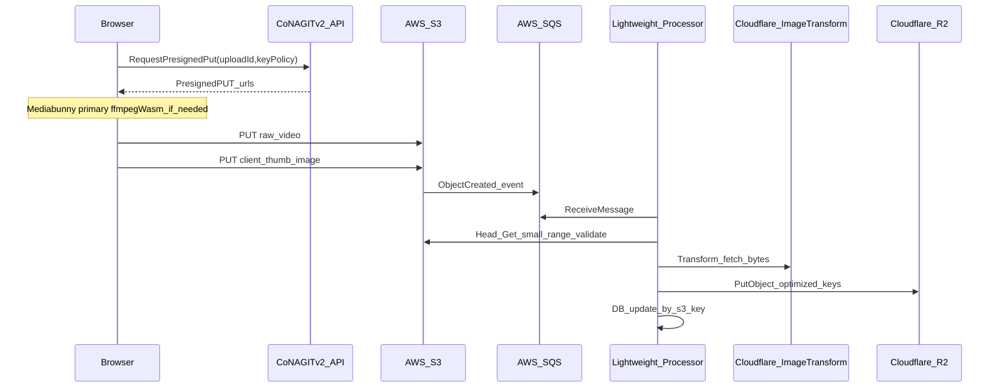

# 画像・メディア処理サブシステム実装計画書（案）

## 1. 文書の置き場と既存計画との関係

- **新規ドキュメント**として [`docs/実装計画書-画像メディアパイプライン.md`](docs/実装計画書-画像メディアパイプライン.md)（仮題）を追加する。既存の [`docs/実装計画書.md`](docs/実装計画書.md) はプロジェクト全体のマスターであり、本書は **メディア入出力・変換・配信** にスコープを絞った **下位の実装計画** とする。
- マスター計画のフェーズ G（アップロード）・K（サムネ＋キュー）と重なる部分は、本書の完了条件を **マスターのトレーサビリティ表**（[`docs/traceability.md`](docs/traceability.md）があれば同様）に 1 行追記できる粒度で書く。

## 2. ゴール（本書で「完了」とする範囲）

- **画像**: JPEG / PNG / WebP のみ（**GIF は対象外**で要件・UI・バリデータから除外）。
- **動画**: 原本は **クライアントから直接 S3**。**先頭フレーム相当の静止画サムネ**はクライアントで生成し、別オブジェクトとして S3 に載せる。**第 1 手段は Mediabunny**（遅延読み・ストリーミング I/O。公式に WebCodecs・lazy 設計の記載あり）。**Mediabunny でデコード不可のときのみ ffmpeg.wasm** で先頭 1 フレーム相当を生成する（フォールバックは入力読み込み・メモリ負荷が大きくなりやすい旨を仕様・UI で明示する）。
- **変換〜配信**: サムネ静止画（および必要なら通常画像）を **Cloudflare 側の画像変換機能**でリサイズ等し、**R2 の公開バケット＋カスタムドメイン**上の決められたキーに保存する。
- **メタデータ**: 処理状態は **ローカル DB** に保存し、**主キー／ユニークは S3 オブジェクトキー**（正規化ルールを別節で定義）でファイルと突き合わせる。
- **負荷分散**: 大容量バイナリは **自宅／低性能サーバーを経由しない**。サーバーは **Presigned URL 発行・キュー消費・軽量検証・外部 API オーケストレーション・DB 更新**に限定する。

## 3. 前提の確定事項（ADR 推奨）

**「Cloudflare トランスフォーメーションズ」**の呼称が指すプロダクトを、実装着手前に 1 本の ADR で固定する。

- 候補: **Cloudflare Images**（アップロード＋バリアント URL からバイト取得）／**Image Resizing（Workers 経由の変換 URL）**／その他の Images 系バインディング。
- 判断基準（文書に列挙）: **課金単位**、**R2 へ自前 PUT する運用との相性**、**既存コード**（Glob 上は [`src/thumbnail/cf-images-probe.ts`](src/thumbnail/cf-images-probe.ts) 等）との再利用度。

※ Cloudflare の具体的 API 名・料金は **公式ドキュメントを出典**として ADR に貼る（本計画本文では断定しない）。

## 4. データフロー（論理）

## 5. AWS 側のおすすめ構成（確定推奨として文書化）

- **S3 → SQS**（＋ **DLQ**）: 自宅サーバーが **HTTPS 受信**より **長期ポーリング**の方が、動的 IP・回線品質に強い。
- **キー設計**: 例として `uploads/raw/{uploadId}/video.bin` と `uploads/raw/{uploadId}/thumb.jpg` のように **同一 uploadId プレフィックス**でペアリングし、DB は **処理対象キー**を `thumb` 側に紐付ける、または両方を行として持つ、のいずれかを仕様で固定。
- **検証 NG**: 方針は **オブジェクト削除**（ユーザー回答）。計画書に **削除失敗時のリトライと手動掃除 Runbook** を 1 節書く。

## 6. クライアント（Web）実装方針

- [`web/`](web/) 側に **アップロード用モジュール**を追加: Presigned 取得 → S3 PUT（**本番は `web/.env.production` の API オリジンと整合**）。
- **動画サムネ（第 1 手段）**: Mediabunny の `Input` + `getPrimaryVideoTrack()` + **`canDecode()` が true** のとき `CanvasSink` または `VideoSampleSink` で **先頭付近タイムスタンプ**（必要なら `getFirstTimestamp()`）の 1 枚を Canvas に描画し、**Blob（JPEG/WebP）**として S3 に PUT。動画本体はサーバーを経由しない。
- **動画サムネ（フォールバック）**: `canDecode()` が false、または Mediabunny が対象コンテナ・コーデックで失敗した場合に **ffmpeg.wasm** で先頭 1 フレーム相当を生成。**仕様に必ず書くこと**: フォールバック経路は **動画データの読み込み量・メモリ・処理時間**が主経路より大きくなりやすいため、**ファイルサイズ上限**・**ユーザーへの待ち表示**・**タイムアウト**を定める。可能なら **MVP では対応コンテナ（例: MP4 + H.264）のみ**とし検証コストを下げる（任意・推奨）。
- **画像のみ**のケース: そのまま S3 raw に PUTし、サムネ生成が不要ならキュー側で分岐可能（仕様で「常に thumb を別キーに書く」かを決める）。

## 7. サーバー側（Node / 既存バックエンド）の責務分割

- **重くしない**: 画像デコードの本格処理は **オプション**（最小は magic byte + `Content-Type` + サイズ上限）。厳密な破損検査を入れる場合は **別ワーカー／別マシン**または頻度制限を計画に明記。
- **既存との接続**: Glob 上 [`src/routes/upload.ts`](src/routes/upload.ts)、[`src/thumbnail/enqueue.ts`](src/thumbnail/enqueue.ts)、[`src/thumbnail/process-queue-message.ts`](src/thumbnail/process-queue-message.ts) を **調査・再利用の第一候補**とし、現状が Cloudflare Queues 前提なら **SQS 版アダプタ**を同インターフェースで差し替える、と文書に書く（実装時にコード確認）。

## 8. DB（Docker なし・バックアップ重視）

ユーザー条件: **Docker は避けたい**、**SQLite 単体は弱い**、**最低限バックアップ可能**。

**計画書での第一推奨（案）**: **SQLite + Litestream**（単一バイナリで **継続レプリケーション先を R2 または S3** に設定）。Docker 不要、常駐は軽量、復旧手順を Runbook 化しやすい。

- **注意（文書に明記）**: 同時書き込みは SQLite の制約に依存。**キュー消費は原則シングルワーカー**、または WAL + 短トランザクションに限定する設計にする。
- **代替案**: OS パッケージの **PostgreSQL（コンテナなし）** + `pg_dump` を R2/S3 へ定期退避（リソースは SQLite より重い）。

既存マスターは D1 前提の記述があるため、本書末尾に **「メディア処理系はローカル SQLite+Litestream、既存 D1 は認証・メタ等」** のような **データストアの役割分担** を 1 表で書き、[`docs/decisions/`](docs/decisions/) に ADR を残す。

## 9. R2・配信

- **パブリック読取 + カスタムドメイン**（ユーザー確定）。計画に **公開オブジェクトキー規約**（例: `optimized/{uploadId}/{variant}.webp`）と **キャッシュヘッダ**、**誤公開時の緊急手順**へのリンク（既存 [`docs/runbooks/aws-s3-cloudfront.md`](docs/runbooks/aws-s3-cloudfront.md) 等があれば参照）を含める。

## 10. マイルストーン（実装順）

1. **キー規約・DB スキーマ案**（S3 キー正規化、状態遷移: `received` / `validating` / `transforming` / `r2_written` / `failed`）。
2. **Presigned 二段（動画 + サムネ）** の API とクライアント PoC（Mediabunny 組み込み）。
3. **S3 通知 → SQS → プロセッサ**（既存キュー処理があれば移植）。
4. **Cloudflare 変換 → R2 PUT**（ADR で選んだ API に合わせた実装）。
5. **監視・DLQ・バックアップ復元テスト**（Litestream のリストア手順を Runbook 化）。
6. **E2E**（[`e2e/`](e2e/) にクリティカルパスを追加する方針を書く）。

## 11. リスク（計画書に表形式で載せる項目例）

| リスク | 緩和 |
|--------|------|
| CF 変換 API のレート制限・障害 | 指数バックオフ、DLQ、手動再処理手順 |
| S3 と DB の不整合 | S3 キーを正とした冪等処理、再配信時の状態マシン |
| SQLite のロック | シングルプロセッサ、短トランザクション |
| WebCodecs / `canDecode()` false で Mediabunny サムネ不可 | ffmpeg.wasm フォールバック、対応ブラウザの明示、MVP では入力形式を限定する選択肢 |
| ffmpeg.wasm フォールバック時のメモリ・時間増 | 動画サイズ上限、タイムアウト、進捗表示、失敗時はサムネ無しで動画のみ S3 等を仕様で決める |
| Mediabunny のライセンス（MPL-2.0） | 改変配布時の義務確認（npm ページ・リポジトリの LICENSE）。利用のみなら通常問題にならない旨を法務は別途確認 |

## 12. 外部検証・実現可能性（追記）

以下は **2026-05 時点の公開情報** に基づく。実装・契約前に各公式を再確認すること。

| 項目 | 検証結果 | 出典 |
|------|------------|------|
| Mediabunny | npm パッケージ `mediabunny` が存在し、ブラウザ向けメディア読み書き・**CanvasSink でのサムネ**・**WebCodecs**・**Streaming I/O / lazy** の記載がある。TypeScript 5.7+ 要件の記載あり。 | [npm: mediabunny](https://www.npmjs.com/package/mediabunny)、[Mediabunny Quick start](https://mediabunny.dev/guide/quick-start) |
| Litestream + R2/S3 | S3 互換ストレージへのレプリケーション手順が公式にあり、**R2 を含む**旨の記載がある。 | [Litestream: S3-compatible](https://litestream.io/guides/s3-compatible) |
| Cloudflare 画像変換 | 本計画で用いる API・商品名は **ADR で確定**（料金・上限は公式の最新版を引用）。 | ADR 作成時に公式ドキュメント URL を記載 |

**判断（一般論）**: 「クライアント直 S3 + SQS + 軽量プロセッサ + CF 変換結果の GET + R2 PUT + SQLite+Litestream」は、技術的に通る一般的な構成である。不確実性は主に **ブラウザのコーデック対応** と **Cloudflare 側の選定プロダクトの課金・上限** に集中する。

## 13. クライアント動画サムネイル戦略（要約）

1. **常に** Mediabunny を試行し、成功時のみその Blob を S3 の thumb キーへ PUT。  
2. 失敗時のみ ffmpeg.wasm を起動し、同一 thumb キー方針で生成。  
3. いずれも失敗した場合の挙動（**動画のみアップロード許可** vs **全体エラー**）を仕様で 1 行に固定する。  
4. 別紙 [`docs/実装計画書-画像メディアパイプライン.md`](docs/実装計画書-画像メディアパイプライン.md) には上記と **サイズ上限・タイムアウト** を必ず複写する。

## 14. 成果物チェックリスト（ドキュメント）

- 新規: [`docs/実装計画書-画像メディアパイプライン.md`](docs/実装計画書-画像メディアパイプライン.md)
- 更新候補: [`docs/実装計画書.md`](docs/実装計画書.md) の「§3 トレーサビリティ」に 1 行追記、`docs/decisions/` に **データストア分担（D1 vs ローカル）** と **CF 変換プロダクト選定** の ADR

---

**出典・未確定の扱い**: Cloudflare の正式なプロダクト名・API・料金は **公開ドキュメントへのリンク付きで ADR に記載**する。Litestream・Mediabunny は §12 の表の URL を正とし、**ffmpeg.wasm** は採用パッケージ確定後に公式 README・ライセンスを出典として ADR または別紙に追記する。

**Mediabunny ライセンス**: npm 上は **MPL-2.0** と記載されている（§12 出典）。利用条件の最終判断は必要に応じて法務・社内規程に委ねる。
